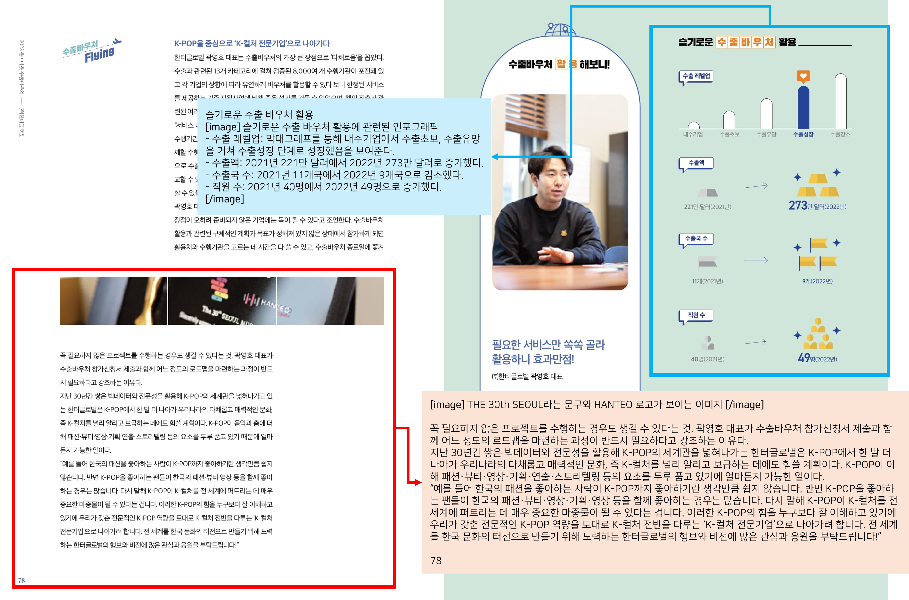

# Introduction: KO-OCRAG (OCR for RAG)😋
   
   
`공공데이터셋포털`에서는 실제 산업에서 활용되는 다양하고 복잡한 구조를 가진 한국어 문서를 풍부하게 제공하고 있습니다.  
저희는 공공데이터를 직접 수집하고 가공하여, 기존의 단순한 **한국어 문서 OCR**이 아닌 **RAG용 한국어 문서 OCR**을 평가할 수 있는 데이터셋인 **🔥KO-OCRAG🔥**를 제작하게 되었습니다.  

저희 KO-OCRAG 데이터셋에서는 아래와 같은 VLM 모델의 성능을 평가할 수 있습니다.🔥🔥
```
- 복잡한 한국어 문서 구조 이해
- 고해상도 한국어 문서 OCR 능력
- 문서에 존재하는 visual information에 대한 text description 생성 능력
- RAG parsing에 적합한 description 생성 능력
```

저희가 제작한 KO-OCRAG 데이터셋은 기존 한국어 VLM 평가 데이터셋들과 비교하였을 때 아래와 같은 주요한 차별점이 있습니다!
```
고해상도의 복잡한 구조를 가진 다양한 한국어 문서. (다양성 🌟)
RAG parsing에 적합한 description 생성 능력. (RAG 🌟)
```

# Environment
`공공데이터셋포털`에서 수집한 데이터셋을 기반으로 만든 한국어 VLM 벤치마크 데이터셋 **(KO-OCRAG)**

```
pytorch == 2.3.0 with cuda 12.1
transformers == 4.51.3
tokenizers == 0.21.1
qwen-vl-utils[decord] == 0.0.8
accelerate == 1.6.0
flash-attn == 2.7.4.post1
```

# Contents
1. [Introduction](https://github.com/Marker-Inc-Korea/KO-VQA-Benchmark?tab=readme-ov-file#introduction)😋
2. [How to make datasets](https://github.com/Marker-Inc-Korea/KO-VQA-Benchmark?tab=readme-ov-file#how-to-make-datasets)👽
3. [How to evaluate](https://github.com/Marker-Inc-Korea/KO-VQA-Benchmark?tab=readme-ov-file#how-to-evaluate)🦾
4. [Results](https://github.com/Marker-Inc-Korea/KO-VQA-Benchmark?tab=readme-ov-file#results)🌟
5. [References](https://github.com/Marker-Inc-Korea/KO-VQA-Benchmark?tab=readme-ov-file#references)

# How to make datasets👽
`공공데이터셋포털`에서 제공하는 다양한 데이터셋은, 실제 산업에서 활용되는 다양하고 복잡한 구조를 가진 한국어 문서로 구성되어 있습니다.  
저희는 `공공데이터셋포털`에서 수작업으로 `고해상도/복잡한 구조/풍부한 이미지&도식`을 복합적으로 가지고 있는 문서 페이지 약 100장을 수집했습니다.🦾   
그리고 각 데이터셋에 OCRAG 벤치마크를 위한 ground-truth caption을 만들기 위해, 총 3차의 데이터 정제 과정을 걸쳤습니다.
- 1차: `gemini-2.5-pro`를 활용해 데이터 생성
- 2차: `human editing`을 걸쳐 데이터 정제
- 3차: `human editing`을 통해 `RAG parsing`에 적합한 데이터 제작
   
KO-OCRAG 데이터셋의 일부 [subset](https://github.com/Marker-Inc-Korea/KO-VLM-Benchmark/blob/main/data/complex_document_OCR_benckmark_subset.xlsx)을 `complex_document_OCR_benckmark_subset.xlsx`에서 확인하실 수 있습니다.🌞  
> 전체 문항에 대해서는, 데이터 유출 및 데이터 저작권 문제로 인해 공유가 어렵습니다🤫  
> GT에 해당하는 열은 `RAG-Parsing` 입니다!

# How to evaluate🦾
KO-OCRAG 데이터셋은 기본적인 텍스트 OCR 능력과 더불어서, 이미지/도식에 대한 description에 대해서 평가가 이루어져야합니다.🦾  
이때 텍스트 OCR은 정답이 정해져 있는 반면, 이미지/도식에 대한 description에 대한 명확한 정답은 없습니다.🤫    
  
이러한 점을 모두 고려하여 저희는 아래의 3가지 metric에 대한 average score를 활용하였습니다:
- `WER`: Word error rate 평가
- `CER`: Charater error rate 평가 
- `Rouge-2 Recall`: 이미지/도식에 대한 description의 의미적 능력 평가
> Average score: {(1-`WER`) + (1-`CER`) + `Rouge-2`}/3

저희가 평가에 이용한 prompt는 다음과 같습니다:
```
당신은 RAG parsing을 위한 Optical Character Recognition (OCR)을 수행하는 AI assistant 입니다. 
다음 주어진 문서에 나타난 한국어 텍스트 문단을 모두 반영하고, 이미지/도식 중 중요하지 않은 내용은 반영하지 않습니다.
이때 텍스트는 그대로 적고, 이미지/도식은 [image]~[/image]라는 구분기호와 적절한 설명으로 대체하여 적어야합니다. 
OCR 결과:
```
  
---

평가 코드는 아래 심플하게 돌려볼 수 있습니다!  
```bash
sh eval_OCRAG.sh
```
> You need to set `base_model` and `huggingfacce_token`.
  
# Results🌟
| Model | KO-OCRAG (Avg.) |
| ------------- | ------------- |
| `Gemini-2.5-pro` | NaN |
| `Gemini-2.5-flash` | NaN | 
| `Qwen2.5-VL-32B-Instruct` | NaN |
| `Qwen2.5-VL-7B-Instruct` | NaN |
| `Ovis2.5-2B (w/ thinking)` | NaN |
| `Ovis2.5-2B (w/o thinking)` | NaN |
| `VARCO-VISION-14B-HF` | NaN |
| `Gukbap-Ovis2-16B` | NaN |
| `Ovis2-16B` | NaN |
| `gemma-3-27b-it` | NaN |
| `Gukbap-Gemma3-27B-VL` | NaN |
| `Gukbap-Gemma3-12B-VL` | NaN |
| `Ovis2-34B` | NaN |
| `Gukbap-Ovis2-34B` | NaN |
| `gemma-3-12b-it` | NaN |
| `Bllossom-AICA-5B` | NaN |
   
# References
- [공공데이터셋포털](https://www.data.go.kr/index.do)
