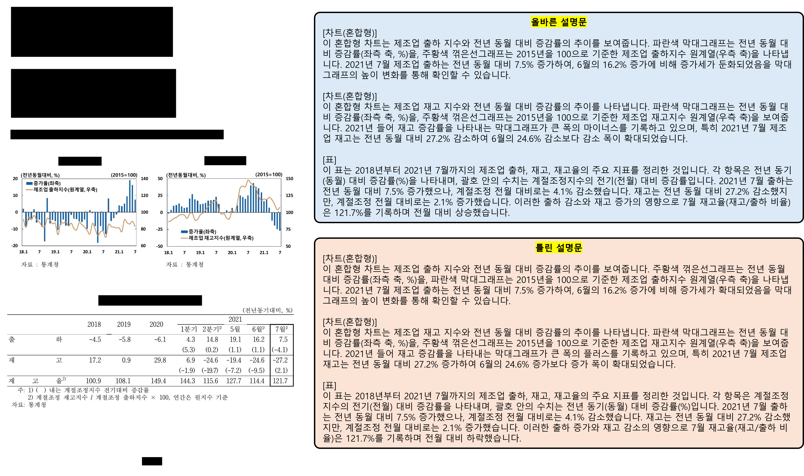

# Introduction: KO-VDC (visual context description choice)😋
   
AIhub에서 제공한, (TODO) 

저희 KO-VDC 데이터셋에서는 아래와 같은 VLM 모델의 성능을 평가할 수 있습니다.🔥🔥
```
(TODO)
```

저희가 제작한 KO-VDC 데이터셋은 기존 한국어 VLM 평가 데이터셋들과 비교하였을 때 아래와 같은 주요한 차별점이 있습니다!
```
(TODO)
```

# Environment
시각화자료질의응답 데이터셋을 기반으로 만든 한국어 VLM 벤치마크 데이터셋 **(KO-VQA)**

```
pytorch == 2.3.0 with cuda 12.1
transformers == 4.51.3
tokenizers == 0.21.1
qwen-vl-utils[decord] == 0.0.8
accelerate == 1.6.0
flash-attn == 2.7.4.post1
```

# How to make datasets👽
(TODO)
  
KO-VDC 데이터셋의 일부 [subset]()을 `(TODO)`에서 확인하실 수 있습니다.🌞
> 전체 문항에 대해서는, 데이터 유출 및 데이터 저작권 문제로 인해 공유가 어렵습니다🤫

# How to evaluate🦾
(TODO)

---

평가 코드는 아래 심플하게 돌려볼 수 있습니다!  
```bash
# Evaluation code
sh eval_VDC.sh
```
> You need to set `base_model` and `huggingfacce_token`.
  
# Results🌟
| Model | KO-VDC (Acc.) |
| ------------- | ------------- |
| `Gemini-2.5-pro` | NaN |
| `Gemini-2.5-flash` | NaN | 
| `Qwen2.5-VL-32B-Instruct` | NaN |
| `Qwen2.5-VL-7B-Instruct` | NaN |
| `Ovis2.5-2B (w/ thinking)` | NaN |
| `Ovis2.5-2B (w/o thinking)` | NaN |
| `VARCO-VISION-14B-HF` | NaN |
| `Gukbap-Ovis2-16B` | NaN |
| `Ovis2-16B` | NaN |
| `gemma-3-27b-it` | NaN |
| `Gukbap-Gemma3-27B-VL` | NaN |
| `Gukbap-Gemma3-12B-VL` | NaN |
| `Ovis2-34B` | NaN |
| `Gukbap-Ovis2-34B` | NaN |
| `gemma-3-12b-it` | NaN |
| `Bllossom-AICA-5B` | NaN |
   
# References
- [AIHub - 멀티모달정보검색 데이터셋](https://www.aihub.or.kr/aihubdata/data/view.do?currMenu=115&topMenu=100&dataSetSn=71813)
